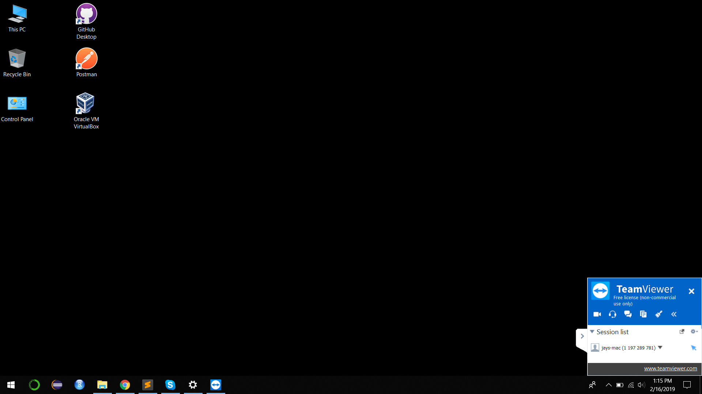

# Uncommon Hacks 2019 Submission

## Inspiration
The first round of any Software Engineering Internship/Full Time positions are mostly online coding challenges where the appliicant is provided with problems on platforms like HackerRank or some other platform, but there is certainity that the applicant may ask some of their friends for help or give the challenge on their behalf and move to the next round.

If the candidate is not that good enough and passes the coding challenge with cheating, he/she is eventually going to fail onsite technical interview, which wastes huge resources for the Hiring Company since it has to allocate one of their engineer for the interview and cover the travelling, accomodation charges of the applicant.

Therefore if cheating can be detected at an early stage, it will have multiple benefits. Major of these are:
1. Only good candidates are passed through
2. Saves time and resources of interviewers, Hiring Company

## What it does

We are using several events to check if the candidate is doing cheating such as:
  - Screensharing thorugh Chrome Desktop share, Teamviewer and Skype etc.
  - If multiple people are present in front of camera while coding challenge is happening.
  - Using Print screen/screenshot

## How we built it

We have noticed some trend over screensharing, such as when usng Google Chrome it shows text at the top such as 
"Your desktop is currently shared with jayrodge15@gmail.com. Stop Button(Button)".

With Teamviewer, it shows:

**We used GCP's cloud vision api and Natural Langauage Processing for verifying and making sure applicant isn't using screensharing for the coding challenge and used Computer Vision and Deep Learning for detecting multiple faces in front of Camera

